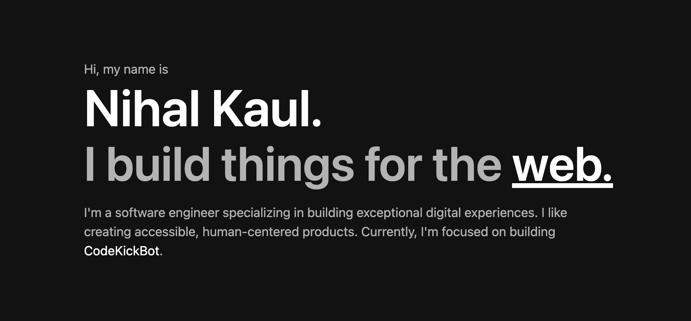

<div align="center">
  
</div>

<h1 align="center">
  nihalwashere.xyz
</h1>



## Built with [Next.js](https://nextjs.org/)

Design of this site is originally inspired from [Brittany Chiang](https://brittanychiang.com).

## 🛠 Installation & Set Up

1. Install and use the correct version of Node using [NVM](https://github.com/nvm-sh/nvm)

   ```sh
   nvm install
   ```

2. Install dependencies

   ```sh
   npm install
   ```

3. Start the development server

   ```sh
   npm run dev
   ```

## 🚀 Building and Running for Production

1. Generate a production build

   ```sh
   npm run build
   ```

2. Preview the site as it will appear once deployed

   ```sh
   npm start
   ```

## 🎨 Color Reference

| Color       | Hex                                                                |
| ----------- | ------------------------------------------------------------------ |
| White       |  `#ffffff` |
| Grey Light  |  `#b3b3b3` |
| Grey        |  `#404040` |
| Grey Dark   |  `#282828` |
| Black Light |  `#181818` |
| Black       |  `#121212` |
